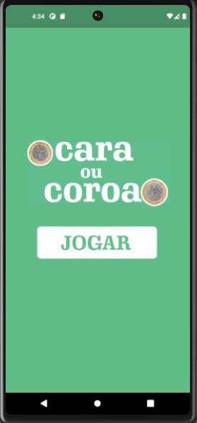

<h4 align="center"> 
	🚧 Cara ou Coroa 🚧
</h4>

	

 <a href="#-sobre-o-projeto">Sobre</a> •
 <a href="#-layout">Layout</a> • 
 <a href="#-como-executar-o-projeto">Como executar</a> • 
 <a href="#user-content--licença">Licença</a>

## 💻 Sobre o projeto

📄 Foi desenvolvido no curso Desenvolvimento Android e IOS com Flutter -Crie 15 Apps de Jamilton Damasceno.

⚪ Trata-se do jogo Cara ou Coroa, onde ao clicar no botão de jogar, é passado para a outra página o resultado, e, assim, é mostrado o resultado na tela.

---

## 🎨 Layout

### Emulador Android

  

---

### 📍 Como executar o projeto

Antes de começar, você vai precisar ter instalado em sua máquina a linguagem Dart e o framework Flutter.
Além disso, você também vai precisar ter configurado o emulador do Android Studio.

---

## 🛠 Tecnologias

As seguintes ferramentas foram usadas na construção do projeto:

- **[Dart](https://dart.dev)**
- **[Flutter](https://flutter.dev)**

---

## 📝 Licença

Feito por Danilo Taveira 👋🏽 [Entre em contato!](https://www.linkedin.com/in/danilo-taveira/)
